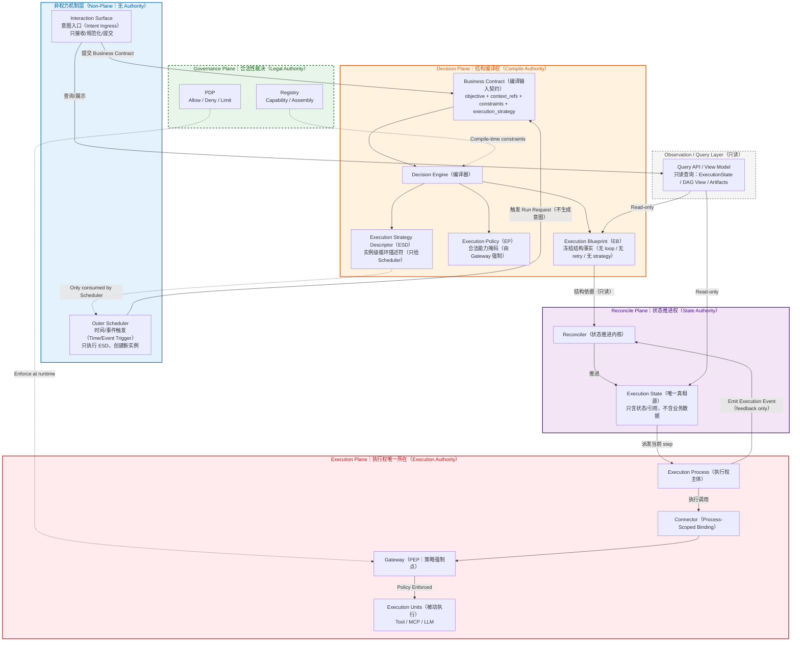
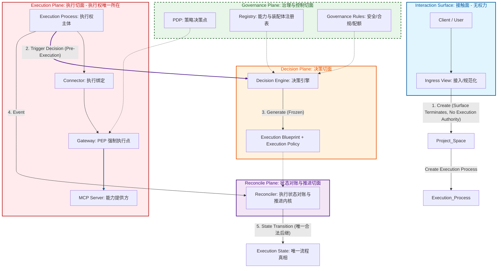
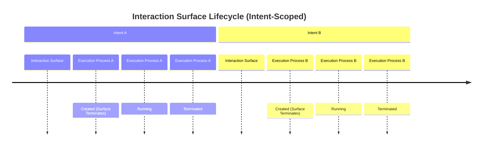
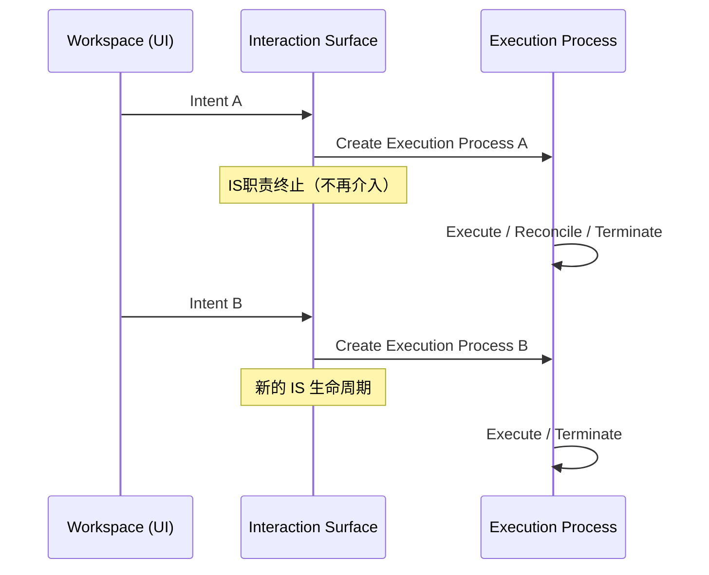

# 核心概念与架构宪法 v1.5

---

[返回🔙](https://www.notion.so/Prometheus-2ffbc670d3638051bf40da648654412c?pvs=21)

---

**截止Feb 11， 2026 星期三，这是 Prometheus - Architecture《核心概念与架构宪法 v1.5》后续设计、代码、评审，一律以此为准。**

---

```
**修正历史：

核心概念与架构宪法 v1.5 Feb 11 2026**
术语：补 Business Contract / Execution Strategy / Strategy Descriptor
增加：七、Outer Scheduler（外层调度机制 · 非权力结构）
删除：IS → SCH → DE 串联图

**核心概念与架构宪法 v1.4.1 Feb 6, 2026
Prometheus - Architecture

核心概念与架构宪法 v1.4 Feb 2, 2026
性质裁决：权力语义纠偏版本（Authority Clarification Release）

本版本并非新增功能或实现建议，而是一次架构权力模型的关键澄清与冻结，用于消除系统在执行期可能被误实现为 Workflow Engine 或 Agent Runtime 的结构性风险。**

本次修正的核心变化：
	**•	正式引入 Reconcile Plane，并在架构语义上替代并终结原 “State Orchestration Plane” 的模糊命名**
	**•	明确 Reconcile Plane 的唯一职责：**
		👉 基于冻结结构，对账并推进 Execution State
	**•	明确写入违宪条款：**
		👉 执行期不得出现路径选择、重试、补偿、fallback、重新规划等“隐式决策”能力
	**•	冻结三平面权力边界：**
		•	Decision Plane：只生成并冻结结构
		•	Reconcile Plane：只推进状态
		•	Execution Plane：只产生不可逆副作用
	**•	明确否定以下系统形态：**
			•	Workflow Engine
			•	Agent Runtime
			•	执行期 Planner / Re-planner	
****本版本用于为后续实现、评审与演进提供不可回退的权力边界裁决依据。

**核心概念与架构宪法 v1.3.2** Feb 1, 2026
	•	统一并冻结 Execution Process / Workspace / Session 的前后端语义映射
	•	强化 Execution Authority 的唯一性定义
	•	明确 Interaction Surface 的职责终止线

**核心概念与架构宪法 v1.3.1 Jan 30, 2026**
语义纠偏与对象定型：把前端的 Workspace 明确降级为 UI 名称；
后端与宪法坚持正确对象模型；前端改名作为第二阶段工作
****
**核心概念与架构宪法 v1.3 Jan 30, 2026**
把“Control Plane（大概念）”与“内部治理切面”彻底解耦，明确 Governance 是静态宪法，Decision 是 POM 编译器。
```

---

# One Page Summary

[**Execution Control Platform｜核心概念一页纸（Architecture Constitution Summary）**](https://www.notion.so/Execution-Control-Platform-Architecture-Constitution-Summary-2ffbc670d3638168b8a5c4fee8be2850?pvs=21)

---

这一页是“封版级认知锚点页”。用来看清：

> 什么是 Plane（有权力）
什么是 Non-Plane（无权力）
谁能改变世界
谁永远不能
> 

---

[**Plane / Non-Plane 统一总览页（封版级）**](https://www.notion.so/Plane-Non-Plane-304bc670d3638071bf7dec4788e1e6de?pvs=21)

<aside>
💡

## Prometheus Architecture 构成：

```
2 个 Non-Plane 机制层
+
4 个 Power Planes（权力切面）

Execution Authority
    ∈ Execution Process
    ∈ Execution Plane

时间属于 Scheduler
因果属于 Blueprint
状态属于 Reconcile
执行属于 Execution

Interaction Surface 接收 Business Contract（含 execution_strategy）。
Decision Plane 编译产生：EB（结构）+ EP（许可）+ ESD（策略描述符）。
EB/EP 进入单次 Execution 生命周期；ESD 仅由 Outer Scheduler 执行，用于实例级循环。
DAG/EB 永远无环；循环只能由 Scheduler 创建新 Execution 实例实现。
```

> Plane 定义权力。
Non-Plane 承载触发。
Decision 冻结结构。
Reconcile 推进状态。
Execution 改变世界。
Scheduler 只创建新的 Execution。
> 

| **能力** | **Surface** | **Scheduler** | **Governance** | **Decision** | **Reconcile** | **Execution** |
| --- | --- | --- | --- | --- | --- | --- |
| 接收 Intent | ✅ | ❌ | ❌ | ❌ | ❌ | ❌ |
| 时间触发 | ❌ | ✅ | ❌ | ❌ | ❌ | ❌ |
| 编译结构（EB） | ❌ | ❌ | ❌ | ✅ | ❌ | ❌ |
| 生成执行许可（EP） | ❌ | ❌ | ❌ | ✅ | ❌ | ❌ |
| 推进 ExecutionState | ❌ | ❌ | ❌ | ❌ | ✅ | ❌ |
| 调用能力 | ❌ | ❌ | ❌ | ❌ | ❌ | ✅ |
| 判断是否合法 | ❌ | ❌ | ✅ | ❌ | ❌ | ❌ |
| 真实副作用 | ❌ | ❌ | ❌ | ❌ | ❌ | ✅ |

Interaction Surface 与 Outer Scheduler**同层**

- Surface 处理 **人/客户端意图**
- Scheduler 处理 **时间/外部事件**

任何将 Scheduler 合并进 Surface 的实现，视为**职责回流风险。**

**主链路：**

> 触发源（Interaction Surface 或 Outer Scheduler）
→ Business Contract
→ Decision Plane
→ 生成 EB / EP / ESD
→ 单次 Execution 生命周期
**若存在循环，由 Outer Scheduler 基于 ESD 再次触发新的 Execution。**
> 
</aside>

---

# **定位与原则（必须先读）**

---

<aside>
💡

**本文档不是设计说明、不是最佳实践、不是实现建议。**

> **本文档是 MCP Platform 的“架构裁决依据（Architecture Constitution）”。**
当实现、讨论、PR、方案与本文档冲突时：
**以本文档为准。**
> 

任何**无法清晰映射到本文档中某一对象及其职责边界的实现**，均视为 **架构风险或违规**。

</aside>

---

## Governance-Centric

AI 时代的核心能力，不是生成智能，而是把智能约束在可治理的结构中。

能被治理的系统，才能产生复利；不能被治理的智能，只会放大不确定性。

| **❌ Intelligence-Centric（隐性失控）** | **✅ Governance-Centric（可复利）** |
| --- | --- |
| 强调“聪明”“自主”“能想”
决策与执行混杂
成功依赖个体英雄主义
出问题难以追责 | 决策权、执行权、验证权清晰分离
拆解产生短反馈
每一步都可审计、可回滚
AI 被限制在明确角色中 |
| 👉 在复杂系统中：**不可规模化、不可审计** | 👉 在复杂系统中：**稳定、可扩展、可演进** |

---

## **设计原则三问**

- 是否还有 **职责无处安放?**
- 是否还有 **权力未被锁死?**
- 是否还有 **未来必然出现、但现在没位置放的概念?**

---

## **文档目标**

在 **产品 / 架构 / 研发 / 平台 / 解决方案** 之间，统一 MCP Platform 的核心概念、权力边界与执行真相，明确：

- 每个对象 **是什么**
- 由谁创建、在什么时候创建
- 在什么层级生效
- **能做什么 / 绝对不能做什么（红线）**
- 在标准执行链路中的**唯一位置**

---

## **总体原则**

1. **一个词只允许一个含义**
2. **能运行的对象，必须有明确生命周期**
3. **能决策的对象，必须被严格限制在决策层**
4. **运行期不得修改已冻结的结构或权限**
5. **任何组件不得绕过 Governance Plane**
6. **只有 Execution Plane 中的执行权主体（Execution Process） 拥有现实世界的执行权**

---

## **术语声明（Terminology Constitution）**

**在本文档中：**

### **Plane（切面）**

指系统中不可跨越的制度结构切面，用于严格划分权力、时间与职责边界。
切面（Aspect / Slice）强调正交切割与强制隔离，而非层级调用。

### **Surface（接触面）(防腐)**

指人与系统或系统与外部的接触边界，不属于系统结构。
接触面是“薄的”，不承载决策、结构或执行权力。

### **Domain（领域）**

指语义或责任的讨论范围（如治理、安全、业务），不指代运行时结构。

### **Interface（界面）**

指 Surface 的具体实现形态，如 User Interface、API、CLI。

因此：

- **Governance / Decision / Reconcile / Execution 均为 Plane（切面）**
- **Interaction 为 Surface（接触面）**
- **Security / Business 等为 Domain（领域）**

三者不可混用。

### **Non-Plane Mechanism（非权力机制）**：

- 不属于 Plane（无制度权力）
- 不承载决策/状态/执行权
- 仅承载“触发/投递”机制（如 Interaction Surface / Outer Scheduler）

### **Business Contract（业务契约 / 编译输入契约）**：一次执行的输入契约，包含

- objective / intention（要什么）
- constraints（约束）
- context refs（上下文引用）
- **execution_strategy（执行策略意图）**

Business Contract 不描述执行结构，不包含步骤顺序。

### **Execution Strategy（执行策略意图）**

- **Execution Strategy（执行策略意图）**：描述“是否以及如何重复创建新的 Execution 实例”的策略意图（如 max_runs / cron / until-condition）。
- Execution Strategy **不属于 EB**，不描述 DAG 结构，不产生执行期分支。
- **execution_strategy 是 Business Contract 的一部分，但永远不进入 EB；Decision 将其编译为 Strategy Descriptor；Scheduler 只执行 Strategy Descriptor（实例级循环），不读取 ExecutionState，不订阅 ExecutionEvent。

🔴 Execution Strategy 条件表达冻结条款：**
    
    Execution Strategy 中的条件表达必须基于外部可观察结果或显式结果摘要（artifact-level summary）。
    不得基于 Execution State、StepState 或内部节点状态进行循环或重试判断。
    
    Execution Strategy 不得读取或订阅 Execution Event。
    

### **Execution Strategy Descriptor（策略描述符）**

- **裁决要点**：Descriptor 是 Decision 编译产物，交给 Scheduler 执行；Scheduler 不能“理解意图”。
- **Execution Strategy Descriptor（策略描述符）**：由 Decision Plane 在编译期产生的、可执行的调度策略中间表示（IR），供 Outer Scheduler 执行。
    
    Descriptor 只能描述 **实例级循环**（Instance Loop），不得表达图内循环或执行期重试。
    

```
**术语折中与前后端映射声明（冻结）**

为兼容既有产品表达与用户心智模型，
前端与对外 API 中暂时使用“Workspace”作为长期工作空间的产品名称。

但在系统语义与架构宪法中，术语必须严格映射如下：
	•	Workspace（UI） ≡ Project Space
表示长期存在的组织空间，不承载执行权，不参与执行生命周期。
	•	Session / Chat ≡ 编译上下文（Compilation Context）
表示意图收集与上下文承载，不拥有执行权，不触发副作用。
	•	Execution Process ≡ 唯一执行权主体（Execution Authority Holder）
表示一次运行的内核级执行实例，生命周期严格等同于一次执行。

⸻

制度裁决（不可违反）
	1.	Workspace（UI）不属于 Execution Plane。
	2.	Workspace（UI）不拥有 Execution Authority。
	3.	Execution Authority 只存在于 Execution Process。
	4.	前端命名不得影响后端对象的生命周期、权限与裁决语义。
	5.	系统中不得出现“UI Workspace 等同于执行实体”的实现或表达。

⸻

**关键区分（冻结）**

	- Workspace 是“空间”语义。
	- Execution Process 是“进程”语义。

	- 空间可以长期存在，
	- 进程只能一次运行后终止。

	- 两者在制度上不可混淆。
	
**违宪示例说明：**
	若前端将 Workspace 直接映射为可执行对象，或允许 Workspace 持有执行权，视为架构违宪。
```

---

# **一、整体架构观：权力切面 vs 接触面**

## **1.1 架构不是“层级调用”，而是“权力结构”**

系统由**四大权力切面（Power Planes），两个非权力机制层（Non-Plane Mechanisms）。**

**权力切面 Power Planes：**Governance / Decision / Reconcile / Execution
**非权力机制层 Non-Plane：**Interaction Surface / Outer Scheduler

> 本版本新增 Outer Scheduler，但 **不新增 Plane**（不改变权力结构）。
> 

---

## **Power Planes（四大权力切面）**

用于定义：**谁在什么时候拥有“决定权”**

- **Governance Plane（治理切面）：**定义世界允许什么发生的**静态宪法；**不接纳意图、不生成计划、不参与执行。
- **Decision Plane（决策切面）**：这次任务使用什么结构
- **Reconcile Plane（状态对账与推进切面）**：基于冻结的EB，对账 Execution Events， 并推进唯一合法的 Execution State。
- **Execution Plane（执行切面）**：真实执行、改变世界

**术语澄清（冻结）**

- *AI Control Plane*：平台级概念（本系统整体）
- *Governance Plane*：内部权力切面之一
**二者不可混用。**

---

## **Interaction Surface （接触面 - 对外交互边界 - 无权力）**

**仅用于意图进入系统，不参与任何决策、编排或执行**

- **Client / Ingress View（接入、视图）**

---

### **🔴 架构红线**

> 任何将 Surface 职责提升为 Plane 权力的设计，均视为架构违规。
> 

```markdown
Power Planes（四大权力切面｜唯一权力归属）

├── Governance Plane
│    ← 定义合法性（Legal Authority）
│    ← 决定“什么被允许存在与使用”
│
├── Decision Plane
│    ← 结构编译权（Compile Authority）
│    ← 决定“这次任务的冻结结构（EB）与许可（EP）”
│
├── Reconcile Plane
│    ← 状态推进权（State Authority）
│    ← 决定“当前执行推进到哪一步”
│
└── Execution Plane
     ← 执行权（Execution Authority）
     ← 真实改变世界的唯一所在

======================================================

Non-Plane Mechanisms（非权力机制层｜不承载任何 Authority）

├── Interaction Surface
│    ← 意图入口（Intent Ingress）
│    ← 不参与决策 / 不参与执行
│
└── Outer Scheduler
     ← 时间 / 事件触发（Time / Event Trigger）
     ← 只创建新 Execution 实例
```

| **语义动词** | **制度归属对象** | **Authority 类型** |
| --- | --- | --- |
| 决策 | Decision Plane（Decision Engine） | Compile Authority |
| 推进（对账） | Reconcile Plane（Reconciler） | State Authority |
| 执行请求发起 | Execution Process | Execution Authority |
| 合法性裁决 | Governance Plane（PDP） | Legal Authority |
| 策略强制 | Gateway（PEP） | Enforcement |
| 实际执行 | Execution Units（MCP / Tool / LLM） | 无权力（被动执行） |

## **权力语义映射（冻结）**

- “决策”一词在系统中只允许指向 **Decision Plane**。
- “推进”一词只允许指向 **Reconcile Plane**。
- “执行权”只存在于 **Execution Process**。
- “合法性裁决”只属于 **Governance Plane**。
- “真实副作用产生”只发生在 **Execution Units**，但其执行权来源于 Execution Process。

## **📐 v1.5 封版架构图（中文版 · 强化 Interaction 与 Scheduler）**



## **📐 v1.4 封版架构图（尚未启动 Scheduler）**



```
**Connector 的制度定位（冻结）**

Connector 是 Execution Process-scoped 的运行期绑定实例。

Connector 的存在前提：

只有在某个 Execution Process 已合法创建后，Connector 才能被创建。

⸻

权力来源裁决
	•	Execution Authority 只属于 Execution Process。
	•	Connector 不拥有 Execution Authority。
	•	Connector 只能在 Execution Process 的指令下存在与使用。

⸻

生命周期裁决（必须同时成立）
	1.	Connector 的生命周期严格受限于其所属的 Execution Process。
	2.	Execution Process 终止时，所有关联 Connector 必须销毁。
	3.	Connector 不得跨 Execution Process 复用。
	4.	Connector 不得在 Execution 生命周期外存在。

⸻

前后端语义澄清（冻结）

在产品体验层面：
	•	Execution Process 可能由 Workspace（UI）中的一次 Run 行为触发。

但在系统语义中：
	•	Execution Process 由系统内核创建。
	•	Workspace（UI）不拥有执行权。
	•	Workspace 只是触发意图的载体。
	•	Connector 从不属于 Workspace。

⸻

制度性区分（不可混淆）

Workspace 是“空间”语义。
Execution Process 是“进程”语义。
Connector 是“进程内部绑定实例”。

三者在制度上不可混淆。

⸻

更强制度版本（如果你想更“硬核”）

可以加一句非常有力的裁决：

任何试图让 Connector 脱离 Execution Process 独立存在、缓存复用、或持有决策能力的设计，均视为架构违宪。
```

<aside>
💡

## **Connector 的制度定位（冻结）**

Connector 是 **Execution Process-scoped 的运行期绑定实例**。

**Connector 的存在前提：**

只有在某个 Execution Process 已合法创建后，Connector 才能被创建。

---

### **权力来源裁决**

- Execution Authority 只属于 Execution Process。
- Connector 不拥有 Execution Authority。
- Connector 只能在 Execution Process 的指令下存在与使用。

---

### **生命周期裁决（必须同时成立）**

1. Connector 的生命周期严格受限于其所属的 Execution Process。
2. Execution Process 终止时，所有关联 Connector 必须销毁。
3. Connector 不得跨 Execution Process 复用。
4. Connector 不得在 Execution 生命周期外存在。

---

### **前后端语义澄清（冻结）**

在产品体验层面：

- Execution Process 可能由 Workspace（UI）中的一次 Run 行为触发。

但在系统语义中：

- Execution Process 由系统内核创建。
- Workspace（UI）不拥有执行权。
- Workspace 只是触发意图的载体。
- Connector 从不属于 Workspace。

---

### **制度性区分（不可混淆）**

Workspace 是“空间”语义。

Execution Process 是“进程”语义。

Connector 是“进程内部绑定实例”。

三者在制度上不可混淆。

---

### 裁决

**任何试图让 Connector 脱离 Execution Process 独立存在、缓存复用、或持有决策能力的设计，均视为架构违宪。**

</aside>

---

# **二、Governance Plane（治理切面 · 静态宪法）**

**本章性质说明**

**Governance Plane 定义世界允许什么发生，并确保任何执行都无法绕过。**

---

## **2.1 Governance 的本质定义（冻结）**

Governance Plane 是系统的静态宪法层。它定义并冻结：

- 世界中**哪些 Capability / Assembly 是合法存在的**
- 在什么组织 / 环境 / 合规条件下**允许被使用**
- 哪些边界**永远不可被 Decision 或 Execution 越过**

**Governance Plane：**

- 不接纳意图（Intention）
- 不生成 POM / Assembly
- 不参与执行
- 不随任务变化

**它只裁定一件事：“什么在制度上是合法的。”**

**关键词（必须同时满足）：**

- **事前**（Preemptive）
- **预定义**（Declarative）
- **强制**（Enforceable）
- **可追责**（Auditable）

---

### **裁决原则（必须理解）**

- 凡是 **“定义边界”** 的，必在 Governance Plane
- 凡是 **“决定一次具体行为”** 的，才有资格进入其他 Plane
- 凡是 **运行期才判断、靠自觉约束** 的，都不是治理

---

## **2.2 Governance Plane 的组成结构**

Governance Plane 由多个 **治理子域（Governance Domains）** 构成，它们共同作用于 Decision / Reconcile / Execution，但不被其调用。

```
**Governance Plane（Legal Authority）**

├── Security Governance        → Who can call
│    └── 身份 / 访问控制 / 凭证合法性
│
├── Cost & Quota Governance    → How much can be used
│    └── 调用配额 / 成本预算 / 限流边界
│
├── Compliance Governance      → Under what regulatory constraints
│    └── 合规规则 / 审计要求 / 风险约束
│
├── Organization Governance    → In which tenant / environment
│    └── Tenant / Account / Environment 隔离
│
├── Capability Governance      → Which capabilities are legal
│    └── Capability Registry / 风险等级 / 版本状态
│
└── Assembly Governance        → Which structural patterns are allowed
     └── Assembly Registry / 结构合法空间

**Governance Plane（治理切面｜Legal Authority）**

	Governance Plane 是系统的静态宪法层。
	它定义世界允许什么存在与被使用。
	它不参与执行、不参与决策、不推进状态。
	
制度裁决：
1. Governance Domains 是治理维度，而非运行期模块。
2. 它们不属于执行流程。
3. 所有裁决通过 PDP 计算。
4. 所有裁决必须在 Gateway 强制执行。
5. 若某规则无法在 Gateway 执行，则不属于治理。
```

> 上述子域**不是运行时模块，而是治理维度。**
它们的裁决统一通过 PDP 计算，并由 Gateway 强制执行。
> 

### **PDP（Policy Decision Point）**

- 属于 **Governance Plane**
- 只做裁决计算（Allow / Deny / Limit）
- 不执行、不调用、不参与流程

---

## **2.3 Capability Governance（能力治理）**

### **2.3.1 Capability Registry（能力注册表）**

**是什么**

> Governance Plane 中**唯一合法的 Capability 名册，**
用于定义“世界上有哪些能力存在”。
> 

**负责什么（允许）**

- Capability 的存在性、版本、状态
- Capability 与 MCP Server 的映射关系
- Capability的风险等级、合规标签、分类信息

**红线（禁止）**

- ❌ 运行期组件不得修改 Registry
- ❌ Decision / Reconciler 不得私有定义 Capability
- ❌ Execution Process 不得感知 Registry 的全量视图

---

## **2.4 Assembly Governance（装配体治理）**

```
🔥 Assembly / EB / EP 关系裁决（v1.5 封版版）

2.x Assembly、Execution Blueprint（EB）与 Execution Policy（EP）的制度关系（冻结）

Assembly、EB 与 EP 属于不同权力层级的对象，其职责与生命周期严格分离。

⸻

一、对象本质定义（不可混淆）

1️⃣ Assembly（治理对象）

Assembly 是：

Governance Plane 中登记的、被批准的结构范式定义（Structural Pattern Definition）。

	•	属于 Governance Plane
	•	被登记在 Assembly Registry
	•	描述“允许存在哪些结构范式”
	•	不参与运行
	•	不属于某次执行

Assembly 回答的问题是：

世界上允许存在哪些结构类型？

⸻

2️⃣ Execution Blueprint（EB）（结构事实）

Execution Blueprint 是：

Decision Plane 在一次任务中生成的、冻结的执行结构事实。

	•	属于单次 Execution 生命周期
	•	是编译产物
	•	进入 Execution 后不可修改
	•	不属于 Governance
	•	不可复用

EB 回答的问题是：

这一次执行，结构上怎么运行？

⸻

3️⃣ Execution Policy（EP）（合法性许可证）

Execution Policy 是：

一次执行被批准可使用的 Capability 与权限集合。

	•	是治理裁决的编译结果
	•	不描述流程
	•	不影响结构
	•	在 Execution 生命周期内不可修改
	•	由 Gateway 强制执行

EP 回答的问题是：

这一次执行，法律上允许使用什么？

⸻

二、三者关系裁决（制度级）

Assembly ≠ EB ≠ EP

对象	所属层级	是否参与运行	是否可复用	是否描述合法性
Assembly	Governance	❌	✅	❌
EB	Decision → Execution	❌（结构）	❌	❌
EP	Decision → Execution	❌（许可）	❌	✅

⸻

三、核心制度边界（必须同时成立）
	1.	Assembly 不参与 Execution。
	2.	EB 不参与治理裁决。
	3.	EP 不描述结构。
	4.	Execution 中使用的 EB 与 EP，必须同时符合 Assembly Governance 定义的合法空间。

⸻

四、Business Contract 与 Assembly 的制度关系（冻结）

1️⃣ Business Contract 是输入契约

Business Contract：
	•	描述“想做什么”
	•	描述约束条件
	•	可包含 execution_strategy
	•	不描述结构

Business Contract ≠ Assembly

⸻

2️⃣ Assembly 是结构合法空间

Assembly：
	•	描述“允许用什么结构”
	•	不理解业务语义
	•	不解析 Business Contract
	•	不参与决策逻辑

⸻

五、唯一合法连接点（强制裁决）

Business Contract 与 Assembly 的唯一合法连接点是：

Decision Engine

Decision Engine：
	•	在 Governance 约束下
	•	在 Assembly Registry 合法空间内
	•	选择或实例化一个 Assembly
	•	或生成一次性结构（仍必须符合 Assembly Governance）

⸻

六、编译流程（制度表达）

Business Contract
        ↓
Decision Engine（唯一中介）
        ↓
[结构编译]
        ↓
Execution Blueprint（EB）

[合法性裁决]
        ↓
Execution Policy（EP）

⸻

七、关键裁决（必须遵守）
	1.	Business Contract 不得定义、生成或修改 Assembly。
	2.	Assembly 不得感知或依赖 Business Contract。
	3.	Assembly 只能被选择或实例化，不能被推导。
	4.	EB 只能由 Decision 生成，不能由 Governance 生成。
	5.	EP 只能来源于治理裁决，不能由 Execution 推断。

⸻

八、Execution Strategy 一致性补充（v1.5 对齐）

Execution Strategy 不属于 Assembly，不属于 EB。

Decision 对 Business Contract 的处理结果为三元组：

Decision Output = (EB, EP, ESD)

其中：
	•	EB：结构事实
	•	EP：合法许可
	•	ESD：实例级循环策略（供 Scheduler 执行）

ESD 不进入 Execution Plane。

⸻

九、最终封版句（推荐保留）

Business Contract 是“要什么”。
Assembly 是“允许用哪些结构”。
Decision 是“这次选哪一个”。
Execution Blueprint 是“这次怎么跑”。
Execution Policy 是“这次能用什么”。

⸻

🌟 优化说明

相比原版：
	•	删除重复解释
	•	删除教学式推导
	•	强化制度表达
	•	强化权力边界
	•	引入三元组一致性
	•	表格化层级关系
	•	结构更紧凑
	•	更容易做审计与 Code Review

⸻

如果你愿意，我可以：
	•	再帮你重构 Decision Plane 整章，使其完全对齐这段表达
	•	或者把 Assembly Governance 整章压缩成制度版
	•	或帮你做一版“图 + 表 + 裁决条款”的三段式封版版本

这一段已经是宪法核心结构之一，重构得很好。
```

### **2.4.1 Assembly Registry（装配体注册表）**

**是什么**

> Governance Plane 中用于登记、审核、版本化、下线
**Assembly Definition 的唯一治理组件**
> 

**职责**

- 管理 Assembly 的生命周期（Draft / Approved / Deprecated / Disabled）
- 提供 Decision Engine 可选择的 Assembly 集合
- 为审计提供结构溯源

---

### **🔴 装配体裁决条款（必须遵守）**

```
- 系统中不存在“临时 Assembly”“运行期 Assembly”“本地 Assembly”
- 任何 Assembly Definition 若未进入 Assembly Registry，在架构上视为不存在
- Decision Engine 不得绕过 Assembly Registry 生成、实例化或引用任何未登记的 Assembly Definition
- Reconciler 只能基于 Assembly Registry 中登记的 Execution Blueprint，
  对账 Execution Event 并推进 Execution State
- Blueprint 仅作为状态推进依据，真正“执行”的是 Execution Process。
```

---

### 2.4.2 Assembly

<aside>
💡

Assembly 是“治理与复用层面的装配体定义”，
Execution Blueprint（EB）和 Execution Policy（EP）是“一次执行的编译产物”。

也就是说：
Assembly ≠ EB ≠ EP
**但：EB / EP 可以“来源于 Assembly”，且必须受 Assembly Governance 约束。**

</aside>

**三者各自是什么（不混）**

**1️⃣ Assembly（装配体）**

**Assembly 是：治理对象 + 复用模板**

- 存在于 **Governance Plane**
- 被登记在 **Assembly Registry**
- 表示一种**被批准、可复用的执行结构定义**
- 是 **“可能被用来生成 EB 的模板或来源”**

👉 Assembly 回答的问题是：

> “世界上允许存在哪些执行结构范式？”
> 

**关键点：**

- Assembly 是 *Definition*，不是 Execution
- Assembly 不参与运行
- Assembly 不推进状态
- Assembly 不等于某一次执行

---

**2️⃣ Execution Blueprint（EB）**

**EB 是：一次执行的冻结结构事实**

- 存在于 **Decision Plane → Execution 生命周期**
- 是 **编译产物**
- 一旦 Execution 开始即冻结
- 描述：
    - 顺序 / 并发 / 合并
    - 状态迁移结构
    - 不包含合法性、不包含策略

👉 EB 回答的问题是：

> “这一次执行，结构上是怎么跑的？”
> 

**关键点：**

- EB 是 *per-execution*
- EB 不是 Registry 对象（但可溯源）
- EB 不可复用
- EB 不可运行期修改

---

**3️⃣ Execution Policy（EP）**

**EP 是：一次执行被批准的能力与权限集合**

- 存在于 **Decision Plane → Execution 生命周期**
- 是 **治理裁决的编译结果**
- 被 Gateway 强制执行
- 不描述流程、不描述顺序

👉 EP 回答的问题是：

> “这一次执行，法律上允许用什么？”
> 

**关键点：**

- EP 是 *per-execution*
- EP ≠ Assembly
- EP ≠ EB
- EP 不影响结构，只限制合法性

```
Assembly Definition
    ↓（Decision Plane 选择 / 实例化）
Execution Blueprint (EB)   ← 结构事实
Execution Policy   (EP)    ← 合法性裁决

即使某次执行没有复用现成 Assembly，
它生成的 EB / EP 也必须在 Assembly Governance 定义的合法空间内。

换句话说：
	•	Assembly Registry = “世界允许的结构类型集合”
	•	EB = “这次执行的具体结构实例”
	•	EP = “这次执行的合法性许可证”
```

**关键裁决点（逐条）**

1. **Assembly 不是 EB**
    - Assembly 是“可复用定义”
    - EB 是“一次执行的具体结构”
2. **EB 可以来源于 Assembly**
    - Decision Engine 可以：
        - 选择一个 Assembly
        - 实例化它
        - 生成 EB
    - 也可以（在治理允许下）：
        - 不复用现有 Assembly
        - 生成一次性 EB
            
            👉 但：**这个 EB 的“结构范式”仍必须符合 Assembly Governance**
            
3. **EP 永远不是 Assembly 的一部分**
    - Assembly 不携带“合法性”
    - EP 是：
        - Tenant
        - Environment
        - Capability Governance
            
            的裁决结果
            

---

## **2.5 Organization Governance（组织治理）**

### **2.5.1 Tenant（租户）**

**是什么**

> Tenant 是 Governance Plane 中用于资源、策略、可见性隔离的最小治理单元。
> 

**职责**

- 隔离 Capability / Assembly 的可见性子集
- 绑定配额、成本与合规策略
- 定义审计与日志边界

**红线**

```
🔴 Tenant 不参与 Decision、Reconcile 或 Execution 行为
🔴 Tenant 只影响“能不能看到、能不能用”，不影响“怎么做”
```

---

### **2.5.2 Organization / Account（组织 / 账户）**

**是什么**

> Organization 是 Tenant 内部的组织结构表达，用于管理人员、应用与身份。
> 

**职责**

- 用户 / 应用 / Principal 的归属管理
- 角色与权限映射
- 审计可见性范围控制

**红线**

```
🔴 Organization 不定义 Capability 或 Assembly
🔴 Organization 不参与流程、顺序或执行判断
```

---

### **2.5.3 Environment（环境：prod / staging / sandbox）**

**是什么**

> Environment 是 Tenant 内的逻辑隔离环境，用于风险控制与发布治理。
> 

**职责**

- Capability 在不同环境的启停
- Assembly 在不同环境的可见性
- 配额、限流策略的环境差异化

**红线**

```
🔴 Environment ≠ Workspace
```

---

## **2.6 Security / Cost / Compliance Governance**

### **2.6.1 Security Governance**

- 鉴权规则
- Principal / Credential 管理
- 安全策略

### **2.6.2 Cost / Quota Governance**

- 调用配额
- 成本限制
- 预算控制

```
🔴 Quota 判断不得出现在 Reconciler / Execution Process
```

### **2.6.3 Compliance Governance**

- 合规规则
- 风险拦截
- 审计要求

---

## **2.7 Policy Decision Point（PDP）**

**是什么**

> PDP 是 Governance Plane 内部用于**计算策略裁决结果**
> 

**特点**

- 只做裁决计算（Allow / Deny / Limit）
- 不执行、不调用、不参与流程
- 不理解业务语义

**调用时机**

```
PDP 的裁决仅在 Gateway 调用路径中发生
```

🔴 **PDP 冻结条款（新增）**

- PDP 的裁决只回答 *Allow / Deny / Limit*
- PDP 不理解 Intention
- PDP 不理解 Assembly
- PDP 不参与任何“这一次怎么做”的判断

👉 否则 PDP 将被误用为隐式 Decision Engine（严重违宪）

---

## **🔴** Governance **Plane 总红线**

```
- Governance Plane 不参与任何 Execution
- Governance Plane 不产生执行路径
- Governance Plane 的所有规则，必须可在 Gateway 处被强制执行
- 如果某规则无法在 Gateway 处执行，则该规则不是治理
```

---

### Governance **Plane 的一句话总结**

> **Governance Plane 定义世界允许什么发生；
Decision 决定一次任务怎么选；
Reconcile 决定当前到哪一步；
Execution 只负责让事情真的发生。**
> 

---

下一步，把**Control** **Plane定义为**“企业级平台标准形态”。

- 🧱 把 **Organization Governance** 单独抽成一页（供运营/平台看）
- 🔍 用这版 Control Plane 去 **反审现有实现是否有越权**

---

# **三、Decision Plane（决策与装配域）**

**Decision Plane 是系统中唯一的“编译器”。**

它在 **Control Plane (大概念）**定义的合法空间内：

- 接纳用户 Intention
- 编辑 POM（Execution Blueprint & Execution Policy）
- 实例化并冻结 **Execution Blueprint**

Decision 的权力不是“决定世界规则”，而是**在宪法之内，为一次任务生成合法的执行结构**

> Decision Plane ≡ Execution Compiler
它把 **Business Contract（意图）**
编译为
**Execution Blueprint（结构）+ Execution Policy（许可）**
并在执行开始前**冻结产物！**
> 

**编译器的输入 / 输出**

| **编译器世界** | **你们的系统** |
| --- | --- |
| Source Code | **Business Contract + Context** |
| Compiler | **Decision Plane** |
| IR / AST / CFG | **Execution Blueprint (EB)** |
| Target Constraints | **Execution Policy (EP)** |
| Executable | **冻结后的 EB + EP** |

### **编译器的关键特征，DP 全部满足**

### **✅ 编译只发生一次**

- 编译器：程序启动前
- Decision：Execution 开始前

> 执行期不允许重新编译（= 不允许执行期 Decision）
> 

---

### **✅ 编译产物是“结构事实”**

- 编译器输出：控制流图、指令布局
- Decision 输出：**EB（顺序 / 并发 / 合并）**

> EB 就是**CFG（Control Flow Graph）**
> 

---

### **✅ 目标平台约束是独立的**

- 编译器：目标架构 / 权限 / ABI
- 你们：**Execution Policy（合法能力集）**

> Policy ≠ Structure
> 

> 就像 **权限 ≠ 程序结构**
> 

---

### **✅ 运行时不能改结构**

- 编译后不能改程序指令
- Execution 后不能改 EB / EP

```
Decision Plane (Compiler)
  ├── Execution Blueprint (IR / CFG / POM)
  └── Execution Policy (Target Constraints / Capability Mask)
  
在编译器世界：
	•	指令 不能决定是否执行
	•	操作系统 + CPU 权限模型 决定能否执行

在你们系统：
	•	Reconciler 不决定执行
	•	Project Space 不决定合法性
	•	Gateway + Policy 决定是否允许
	•	Capability 只是被动执行

👉 Execution Plane = Runtime + Syscall 层
**Decision 结束之后，系统里就不再存在“思考结构”的能力。
不是 Agent Runtime，而是一个“可编译、可冻结、可治理”的执行系统。**
```

## 3.1 **编译输入的三分法（冻结）**

Decision Plane 的编译输入 Business Contract 必须被拆为三类，并严格产生不同产物：

1. **结构输入（Structure Intent）** → 编译为 **Execution Blueprint（EB）**
2. **合法性输入（Capability Constraints）** → 编译为 **Execution Policy（EP）**
3. **执行策略输入（Execution Strategy）** → 编译为 **Execution Strategy Descriptor（ESD）**

其中：

- Execution Blueprint(EB)：只包含结构事实（无循环、无 retry、无策略）
- Execution Policy(EP)：只包含合法性掩码（不影响结构）
- Execution Strategy Descriptor(ESD)：只描述实例级循环（由 Scheduler 执行），不进入 Execution Plane

## **3.2 Decision Engine（决策引擎）**

**是什么**

Decision Plane 在 Governance Plane 约束下，为任务生成 Execution Blueprint  **+** Execution Policy 的唯一组件。

**生命周期属性**

- 决策期对象
- **每个任务只运行一次**

**负责什么（允许）**

- 判断是否存在可复用 Assembly
- 选择 Capability，在任务开始阶段，基于 Governance Plane 约束，确定本次任务可使用的 Capability 集合（Execution Policy）
- 选择 / 实例化 / 受约束组合 Assembly
- 生成 Execution Policy (EP)

---

### **🔴 决策红线（必须遵守）**

- ❌ 不得在运行期重新生成或修改 Execution Blueprint (EB)
- ❌ 不得调用 Gateway / Capability
- ❌ 不得根据执行结果重新决策
    
    ➡️ **违反即视为 Agent 化风险**
    

🔴 能力选择红线：

- Capability 选择仅允许发生在 EB 生成阶段
- 运行期不得发生任何 Capability 替换或重新选择

```
而一旦承认：Decision Plane = Compiler

那么：
	•	不写 if
	•	不写 retry
	•	Reconciler 纯状态机
	•	Policy 与结构分离

全部都变成了“必然结论”，而不是设计偏好。

如果你愿意，下一步我可以帮你把
**👉 整个系统画成一张“编译器 → 运行时”的对照图，**那会是你们这套宪法最“不可误解”的一页。
```

---

## **3.3 Execution Blueprint (EB)（能力装配体）**

**是什么**

定义能力之间**允许的结构关系与不变量**的结构模板。结构性声明模型 与 顺序 / 并发 / 合并。

**EB 是“结构事实”，不是“执行逻辑”。**

**生命周期属性**

- 设计期 / 决策期生成
- 进入 Execution 后 **不可变（冻结）**

**红线**

- ❌ 不执行
- ❌ 不运行期修改
- ❌ 不感知执行状态
- ❌ EB 不包含 execution_strategy / retry_policy / loop_policy
- ❌ EB 不包含任何 “再次执行一次” 的语义
- ✅ “再次执行一次” 只能由 Scheduler 以 **新 Execution 实例**的形式发生

```
**关于运行期条件判断（冻结）**
	•	系统不支持执行期路径条件（if / else）。
	•	任何会改变执行路径的条件，必须前置到 Decision Plane，并通过选择不同的 Execution Blueprint 实现。
	•	执行期仅允许合法性裁决（Allow / Deny / Limit），裁决失败只会终止执行，不会引发分支、重试或回退。
	•	如需基于新信息选择后续结构，必须结束当前执行，进入新一轮 Decision，生成新的 Execution Blueprint。
```

> **如果一个条件需要“等跑完一步才知道”，那它不该控制“接下来怎么跑”。

我们系不是缺少灵活性，**而是**把灵活性从“执行期即兴”升级为“决策期编译”**。
> 
> 
> **这正是它能长期稳定、可治理、不可 Agent 化的原因。**
> 

---

## **3.4 Execution Policy（EP）**

**是什么**

当前任务被批准可使用的 **Capability 集合（白名单）**。

- Policy 不诱导流程
- Policy 天然是“法律 / 边界 / 裁决”
- 与 Gateway / PDP 语义完美闭环

**Execution Policy ≈ Virtual Capability Contract（推荐同义说明）**

**它是一次任务在 Governance 宪法约束下，被批准可使用的 Capability 集合，相当于该任务的Capability POM**

**Execution Policy 不得被 Execution Plane 解释或推断，只能被 Gateway 强制执行。**

**重要澄清**

- EP **不包含 EB (Execution Blueprint)**
- EP **不包含顺序 / 流程**
- EP 只回答：**能不能用**

🔴 EP 冻结红线：

- EP 在 Execution Lifecycle 内不可修改
- 不允许任何组件维护 EP 的可变副本

```
Business Contract
   ↓ (Decision Plane 编译)
Execution Blueprint (EB)   ← How it is structured
Execution Policy (EP)      ← What is legally allowed
   ↓
State Orchestration
   ↓
Execution

**凡是“决定结构”的，进 Blueprint；
凡是“决定合法性”的，进 Policy；
凡是“需要运行期 if 的”，都不该存在。**
```

---

# **四、Reconcile Plane（对账与推进切面）**

**Reconcile Plane 是执行状态对账与推进切面，是纯状态机，不理解业务，不拥有执行权。Reconciler 是纯状态机，而不是 Workflow Engine。**

## **4.1 Reconciler（执行状态对账与推进内核）**

**是什么**

严格依据 Execution Blueprint 推进流程状态的 **纯状态机内核**。**只负责状态推进，不拥有执行权。**

**生命周期属性**

- 运行期对象
- 不持有业务数据

**负责什么（允许）**

- 基于 **Execution Blueprint**，对账 **Execution Event**，并推进唯一合法的 **Execution State。**
- 接收 **Execution Event** 更新状态

```
Reconcile Plane 的所有判断，只能基于 Execution Blueprint、Execution State 与 Execution Event。

不得基于任何业务数据、执行结果内容、上下文语义或推理结论决定 retry、fallback 或状态迁移。
```

---

### **🔴 Reconcile Plane 红线（必须遵守）**

- ❌ 不生成 Execution Blueprint
- ❌ 不选择 Capability
- ❌ 不调用 Gateway
- ❌ 不接收任何业务数据（CSV / JSON / Video）
- ❌ 不做重试 / fallback / 策略判断

---

## **4.2 Execution Event（执行事件）**

**是什么**

Execution Process → Reconciler 的 **唯一合法状态输入**。

**只包含**

- step_id
- status（SUCCESS / FAILURE / TIMEOUT / VIOLATION）
- signal（结构化）

**红线**

- ❌ 不包含业务数据

---

## **4.3 Execution State（执行状态）**

**结构化、无业务数据**

**是什么**

由 Reconciler 维护的 **唯一权威流程状态**。

**红线**

- ❌ Execution Process 不得自行推断流程状态

🔴 状态唯一性原则：
Execution State 是流程状态的唯一真相来源，
任何组件不得维护第二份“当前流程状态”。

---

# **五、Execution Plane（执行切面）**

<aside>
💡

**本章性质说明（必须先读）
Execution Plane（执行切面）是系统中唯一拥有“执行权（Execution Authority）”的结构切面。**

它负责在所有决策、结构与状态都已确定之后，真实地调用能力、改变外部世界，并返回结果。

📌 **任何能“让事情真的发生”的对象，必须属于 Execution Plane。**

它不决策、不编排、不治理、不理解业务意图，
它只做一件事：**按照既定调用请求，真实地执行能力，并返回结果。**

</aside>

---

## **5.1 Execution Plane 的本质定义（冻结）**

**Execution Plane 回答的问题只有一个：**

> **“当所有决策与流程都已确定，
在这一刻，被批准的动作如何被真实执行？”**
> 

它**永远不回答**：

- ❌ 是否应该执行（Governance Plane）
- ❌ 用什么结构执行（Decision Plane）
- ❌ 现在轮到哪一步（Reconcile Plane）

---

### **🔴 Execution Plane 的核心裁决原则**

```
- Execution Plane 不判断“是否该做”
- Execution Plane 不判断“下一步是什么”
- Execution Plane 不理解 Assembly / Execution Blueprint
- Execution Plane 只执行“被要求执行的那一步”
```

---

## **5.2 Execution Plane 的组成**

Execution Plane 由 **真正执行能力的运行时实体**构成：

```
Execution Plane
└── Execution Process（唯一一等公民（执行权主体）执行进程 / 执行实例）      ← 执行权起点（Execution Authority Origin）
    ├── Execution Binding    ← 抽象概念（属于 Process）
    │    └── Connector       ← 实现形态（Execution Process-scoped）
    ├── Gateway (PEP)
    └── Execution Units ← 真实执行能力
         ├── MCP Server
         ├── Tool
         └── LLM Gateway
```

> ⚠️ 注意
> 
> - **Execution Process（执行进程 / 执行实例）**：决定“这一次执行从哪里开始”
> - **Connector：执行绑定（Execution Process-scoped）**
> - **Gateway**：决定“法律是否被强制”
> - **Execution Units**：决定“动作是否被完成”

```
**Workspace (UI) 是“用户看到的空间”，
Project Space 是“系统理解的空间”。

Execution 永远只发生在 Execution Process 中，
Execution Process 永远只属于 Execution Plane。**
```

---

## **5.3 Execution Process（一等公民， 执行进程 / 执行实例）**

> Connector 不是执行权的一等公民。Execution Binding 的法律主体是 Execution Process。
Connector 只是 Execution Process 的运行期绑定实例（implementation detail），而不是独立的制度性对象。
> 

### **5.3.1 宪法级定义（冻结）**

> **Execution Process（执行进程 / 执行实例） 是一次可执行任务的执行起点，是系统中执行权（Execution Authority）的唯一合法起点。
Execution Process（执行进程 / 执行实例）** 更安全的称谓应始终是：👉「执行权主体（Execution Authority Holder）」
> 

只要某个对象：

- 发起请求
- 调用 Gateway
- 汇总执行结果

👉 **它就必须是 Execution Process（执行进程 / 执行实例），且必须属于 Execution Plane。**

---

### 5.3.2 Execution **Process 的 终止 / 取消 / Kill 语义**

Execution Process 的终止只能由：

- Governance 触发的强制裁决（Quota / Compliance）
- Reconciler 的自然终态
- 平台级运维控制（break-glass）

❌ Execution Process 的终止不得由 Session / User Prompt / Tool 触发。

这会让运维、SRE、合规在未来有清晰抓手。

---

### **5.3.3 Execution Process（执行进程 / 执行实例） 的红线（不可触碰）**

**🔴 执行权红线**

- ❌ 不选择 Capability
- ❌ 不生成或修改 Assembly
- ❌ 不决定流程逻辑（顺序来自 Reconciler）
- ❌ 不绕过 Gateway

📌 Execution Process（执行进程 / 执行实例） **有执行权，但没有决策权。**

---

## **5.4 Connector （执行绑定 · Execution Process-scoped）**

### **5.4.1 Connector 是什么**

> **Connector 是 Capability 在某个 Execution Process 中完成参数配置与授权后的唯一运行态绑定实例(Execution Process-scoped)。**用于将 **Execution Process** 中的一次执行请求，绑定到一个具体的 Execution Unit。
> 

**Connector 是：Execution Process 在“一次执行中”，为了调用某个具体 Execution Unit，所创建的“运行期绑定实例”。**

关键限定词（一个都不能少）：

- **Execution Plane 中，不拥有执行权**
- **执行绑定（不是执行本体）**
- **Execution Process-scoped**
- **运行期存在**

```
**Execution Process
   ↓（授权 / 指令）
Connector
   ↓（转发）
Gateway
   ↓（执行）
Execution Unit

三个“绝对不能反过来”的关系
	1.	❌ Connector 不能创建 Execution Process
	2.	❌ Connector 不能独立调用 Gateway
	3.	❌ Connector 不能决定“要不要执行”
	
Connector 永远是“被调用者”，不是“调用发起者”**

```

**生命周期关系**

**Execution Process 的生命周期**

```
Created
  ↓
Running
  ↓
Terminated
```

**Connector 的生命周期（严格从属）**

```
Execution Process created
  ↓
Connector created (for capability X)
  ↓
Connector used (0..n times)
  ↓
Execution Process terminated
  ↓
Connector destroyed
```

**Connector 的生命周期 ≤ Execution Process 的生命周期**

如果你看到：

- Connector 能跨 Execution Process 复用
- Connector 能被缓存、复活、复用

👉 **那就是严重违宪。**

👉 **FD 不能自己发起 syscall，只能被 Process 使用。**

| **Linux** | **你们** |
| --- | --- |
| Process | Execution Process |
| File Descriptor / Socket | Connector |
| syscall | Gateway |
| Kernel | Execution Plane |

👉 **Binding 不是执行主体。**

| **K8S** | **你们** |
| --- | --- |
| Pod / Job | Execution Process |
| ServiceAccount / Volume / Network binding | Connector |
| API Server | Gateway |
| Container | Execution Unit |

**Connector 与 Execution Process 的关系（冻结）**

Connector 是 Execution Process 在一次执行中，为调用某个具体 Execution Unit 而创建的运行期绑定实例。

- Connector 不拥有 Execution Authority
- Connector 不能独立发起执行
- Connector 的生命周期严格受限于其所属的 Execution Process
- Connector 只能在 Execution Process 的指令下，转发调用至 Gateway

任何试图让 Connector 脱离 Execution Process 独立存在、复用或决策的设计，均视为架构违规。

---

### **5.4.2 Connector 在 Execution Plane 的正确结构位置**

你现在这张结构图是**完全正确的**：

```
Execution Plane
├── Execution Process（执行进程 / 执行实例）        ← 执行权起点
├── Connector        ← 执行绑定（Execution Process-scoped）
├── Gateway (PEP)    ← 策略强制执行
└── Execution Units
    ├── MCP Server
    ├── Tool
    └── LLM Gateway
    
 这张图隐含了一个非常重要的秩序：
	1.	Execution Process（执行进程 / 执行实例） 拥有执行权
	2.	Connector 负责“怎么连”
	3.	Gateway 负责“允不允许”
	4.	Execution Unit 负责“真的做”
```

---

### **5.4.3 Connector 的宪法级红线**

```
- ❌ 不拥有 Execution Authority
- ❌ 不选择 Capability
- ❌ 不独立调用 Gateway
- ❌ 不跨 Execution Process（执行进程 / 执行实例） 复用
- ❌ 不包含流程 / 条件判断
- ❌ 不缓存或推断执行状态

Connector 只能在 Execution Process（执行进程 / 执行实例） 的命令下存在和使用。

- ❌ 不跨 Execution Process（执行进程 / 执行实例） 共享
- ❌ 不参与能力选择
- ❌ 不承载 Tool 逻辑
- ❌ 不包含条件判断或执行顺序逻辑
```

---

## **5.5 Gateway（策略强制执行点 · PEP）**

### **5.5.1 宪法级定义（冻结）**

> **Gateway 是 Execution Plane 中唯一的 Policy Enforcement Point（PEP）。**
它负责将 Governance Plane 的裁决结果，在执行期进行不可绕过的强制执行。
> 
- 强制执行 Governance Plane 裁决
- 所有执行必须经由 Gateway

🔴 系统中 **不存在 REP**（Resource Enforcement Point）。

---

### **5.5.2 Gateway 的职责（允许）**

- 鉴权 / 身份校验
- 配额 / 限流 / 成本控制
- 合规与安全策略执行
- 审计与日志
- 将合法请求转发给 Execution Units

---

### **5.5.3 Gateway 的红线**

- ❌ 不生成策略
- ❌ 不修改裁决
- ❌ 不理解 Assembly / 流程
- ❌ 不做业务判断

📌 **Gateway 只执法，不思考。**

🚫 **系统中不存在 REP（Resource Enforcement Point）**

任何 Execution Unit 均不得进行合法性判断。

---

## **5.6 Execution Units（执行单元）**

### **5.6.1 MCP Server（能力提供方）**

**是什么**

**MCP Server 是按照 MCP 协议，承载并执行 Capability 的运行时服务。**

- 长生命周期
- 独立于 Project Space 存在
- 不感知 Project Space / Assembly / Execution Blueprint
- 不判断合法性

它是 Execution Plane 中最核心的实体。

---

**生命周期属性**

- 长生命周期服务
- 独立于 Project Space 存在
- 不随任务创建 / 销毁

---

**负责什么（允许）**

- 接收来自 MCP Gateway 的调用请求
- 执行对应的 Tool / Capability
- 返回执行结果或错误

---

**🔴 MCP Server 红线（必须遵守）**

```
- ❌ 不感知 Execution Process（执行进程 / 执行实例）
- ❌ 不感知 Assembly / Definition
- ❌ 不感知 VCS
- ❌ 不判断调用是否合法
- ❌ 不理解业务意图
```

一句话：

> MCP Server 只知道“我要执行什么”，
不知道“为什么执行、谁在执行、接下来会发生什么”。
> 

---

### **5.6.2 Tool（能力实现）**

> Capability 在 MCP Server 内部的最小执行单元。
> 
- 纯执行逻辑
- 不调用其他 Tool
- 不访问 Project Space
- 不包含流程控制

### **是什么**

> **Tool 是 Capability 在 MCP Server 内部的最小执行单元。**
> 

---

### **关系澄清（非常重要）**

```
Capability ≠ Tool ≠ MCP Server
```

- Capability：平台层的能力抽象（治理对象）
- Tool：具体实现逻辑（代码）
- MCP Server：Tool 的运行承载体

---

### **🔴 Tool 红线**

```
- ❌ Tool 不得直接调用其他 Tool
- ❌ Tool 不得访问 Project Space
- ❌ Tool 不得包含流程控制逻辑
- ❌ Tool 不得判断合规 / 权限
```

👉 **Tool 是“纯函数式执行单元”（带副作用的那种），不是流程节点。**

---

### **5.6.3 LLM Gateway（模型执行入口）**

### **是什么**

> LLM Gateway 是大模型访问的统一执行入口，
在 Execution Plane 中扮演“模型执行器”的角色。
> 

---

### **生命周期属性**

- 长生命周期
- 可被多个 Project Space 共享

---

### **负责什么（允许）**

- 接收模型调用请求
- 路由至具体模型（OpenAI / 本地 / 私有模型）
- 返回模型输出

---

### **🔴 LLM Gateway 红线**

```
- ❌ 不参与 Decision
- ❌ 不参与 Reconcile
- ❌ 不生成或修改 Assembly
- ❌ 不感知流程状态
```

👉 **LLM Gateway ≠ Agent ≠ Planner**

---

### **5.6.4 LLM Gateway（模型执行入口）**

> 大模型调用的统一执行器。
> 
- 只负责模型调用
- 不参与 Decision / Reconcile
- 不生成或修改结构

---

## **5.7 Execution Plane 与其他切面的边界（裁决级）**

### **与 G**overnance **Plane**

- Governance Plane：裁决是否合法
- Execution Plane：不理解规则，只服从
- **所有执行必须经由 Gateway**

---

### **与 Decision Plane**

- Decision Plane：冻结结构与能力集合
- Execution Plane：只执行被请求的动作
- ❌ 禁止执行期重新决策

---

### **与 Reconcile Plane**

- Reconciler：决定“现在轮到哪一步”
- Execution：执行“被指派的那一步”
- ❌ Execution Plane 不推进状态

---

## **5.8 执行切面总红线（汇总）**

- ❌ 执行期不得选择 Capability
- ❌ 执行期不得修改结构
- ❌ 执行期不得绕过 Gateway
- ❌ 执行期不得基于结果做条件分支
- ❌ Execution Unit 不得拥有合法性判断

---

## **5.10 执行切面的一句话宪法总结**

**Execution Plane 是系统中唯一“让事情真的发生”的地方，**

但它永远不知道：

- 为什么是这一步
- 谁决定了这一步
- 接下来还会发生什么

---

## **5.11 Execution Plane 与其他 Plane 的边界关系**

### **与 Reconcile Plane 的关系**

```
Reconcile Plane：决定“现在轮到哪一步”
Execution Plane：执行“被指派的那一步”
```

🔴 **Execution Plane 不得反向影响流程推进**

---

### **与 Decision Plane 的关系**

```
Decision Plane：决定“这次用什么结构”
Execution Plane：不关心结构，只执行请求
```

🔴 **Execution Plane 不得基于执行结果触发重新决策**

---

### **与 G**overnance **Plane 的关系**

```
Governance Plane：定义规则
Execution Plane：不理解规则
Gateway：在两者之间强制执行
```

🔴 **Execution Plane 不得绕过 Gateway**

---

## **5.12 Execution Plane 的唯一合法调用路径**

```
Project Space
  → Execution Process
      → Connector
          → Gateway（PEP）
              → MCP Server
                  → Tool
```

**任何偏离上述路径的执行，均视为 架构违规。**

---

## 5.14 **Execution Plane 总红线（汇总）**

**🔴 Execution Plane 总红线（汇总）**

```
- Execution Plane 不参与任何决策或编排
- Execution Plane 不感知上下文、流程或结构
- Execution Plane 的执行必须经由 Gateway
- Execution Plane 不得主动触发任何下一步行为
```

---

**Execution Plane 的一句话总结**

> Execution Plane 是 MCP Platform 中唯一“把世界真的改变”的地方，
> 

> 但它永远不知道：
**是谁决定了这一步、
为什么轮到这一步、
以及接下来还会发生什么。**
> 

---

**最后一句（执行层定海神针）**

> **Execution Plane 越“愚钝”，整个系统就越安全、越可演进。**
> 

---

---

下一步可以：

- 🔍 **用这一章反审现有 MCP Server / Tool 实现是否越权**
- 🧱 **生成一页《Execution Plane 实现检查表》**
- 📘 **把 Execution Plane 拆成“给执行团队看的版本”**

这一章的目的是确保我**们的系统在“执行层面”不可能被写歪了。**

---

# **六、Interaction Surface（交互接触面 · 无权力）**

```
关于用户界面 Workspace（UI) 的定位（冻结）

用户界面中的 Workspace（UI) 属于 Interaction Surface 的组织形态，
用于承载用户的长期上下文、Session 与历史。

Interaction Surface 中的 Workspace（UI)：
	•	不属于 Execution Plane
	•	不拥有 Execution Authority
	•	不得直接或间接调用 Gateway

一旦 Execution 开始，Interaction Surface 的职责即告终止。
这一步可以彻底切断 UI Workspace（UI) → Execution Authority 的联想。

**对于用户：
Workspace (UI)
└── Chat
    └── Run
    
对于系统
Project Space
└── Session
    └── Execution Process (EB + EP)
    
Execution Authority 永远只在：
Execution Process ∈ Execution Plane**
```

## 6.1 定义

> **Interaction Surface 是系统与外部的意图接触边界。**
> 

它存在于 **Execution 发生之前**，在 Project Space **创建后即终止职责**。

```
**Interaction Surface 的重要性裁决（冻结）：**

Interaction Surface 是系统中最重要的非权力结构。
它用于承载所有形式的人类、设备与外部系统输入，
包括但不限于：Web UI、CLI、Mobile、Edge Device、External API。

Interaction Surface 的职责是“吸收不稳定输入，并将其规范化为系统可理解的意图”。

正因为其重要性：
- Interaction Surface 被严格禁止拥有任何决策权、执行权或状态推进能力。
- Interaction Surface 不是 Plane，不是 Runtime，不是执行环境。
- Interaction Surface 的所有职责，必须在 Execution 开始前终止。

Interaction Surface 越重要，就越必须保持愚钝。

Interaction Surface 的职责以“意图”为最小生命周期单位。

- 每一个 Intent 进入系统时，都会产生一次 Interaction Surface 生命周期；
- 该生命周期在对应 Execution Process 被创建后立即终止；
- Interaction Surface 生命周期之间相互独立，不共享状态、不继承上下文；
- Interaction Surface 不得在任何 Execution 生命周期内恢复或介入。

Workspace（UI）仅作为承载多个 Interaction Surface 生命周期的用户界面容器存在。
```

### **6.1.1 策略意图表达（冻结）**

Interaction Surface 允许接收并规范化 Business Contract 中的 **execution_strategy** 字段，用于表达“实例级循环意图”（如 max_runs / schedule / until-condition）。

但 Interaction Surface：

- ❌ 不执行该策略
- ❌ 不持有策略运行态
- ❌ 不根据执行结果修改策略
- ✅ 仅将其作为编译输入提交给 Decision Plane

### 6.1.2 Interaction Surface & Workspace (UI)

```
Interaction Surface（概念 / 职责 / 边界）
└── Workspace (UI)（一种具体实现形态）

Workspace（UI）是 Interaction Surface 在用户界面层面的具体实现，
用于承载用户的长期工作空间与上下文，
但不属于系统结构，不拥有执行权，也不参与任何 Execution 行为。

Workspace（UI）作为用户界面实体可以长期存在，
但 Interaction Surface 的职责是按“意图生命周期”出现和终止的。

当某一次 Execution 开始时，
与该次意图对应的 Interaction Surface 职责即告终止，
并且在该 Execution 生命周期内不再恢复。

当用户在 Workspace（UI）中发起新的 Chat / Intent 时，
系统会产生一个新的 Interaction Surface 生命周期，
用于接收和规范化新的意图，
该生命周期与任何既有或正在进行的 Execution 完全隔离。
```

### **含义非常明确：**

- **Interaction Surface**
    
    是一个**架构语义概念**：
    
    - 定义「哪些东西可以作为系统入口」
    - 定义「入口能做什么 / 绝对不能做什么」
- **Workspace (UI)**
    
    是 Interaction Surface 的一种**产品级实现**：
    
    - 是 UI / UX 层给用户提供的长期工作区
    - 承载 Session / 历史 / 上下文
    - 但**不承载任何架构权力**

👉 就像：

- “Network Boundary” 是概念
- “Browser / App / CLI” 是实现

> Interaction Surface 的职责终止，指的是“Surface 的权力语义结束”，而不是 Workspace（UI）实体被销毁或不可见。
> 

Interaction Surface 的职责终止于 Project Space 与 Execution Process 被创建的那一刻；
Workspace（UI）作为用户界面仍然存在，但不再承担任何执行相关职责。

**Interaction Surface 可以多次出现，但每一次都只服务于“新的意图进入系统之前”。**

```
[Interaction Surface #1]
    ↓（Intent A）
[Execution Process A]
    ↓（Execution 生命周期中）
    （IS #1 已终止）

—— 时间分隔 ——

[Interaction Surface #2]
    ↓（Intent B）
[Execution Process B]

关键点三条（缺一不可）：
	1.	Interaction Surface 是“按意图实例化”的
	2.	每个 Intent 对应一个独立的 IS 生命周期
	3.	IS 之间不共享状态、不继承权力、不感知 Execution

Workspace（UI）只是承载这些 IS 生命周期的外壳。

**Workspace 是“房子”，
Interaction Surface 是“一次敲门”。

门可以被反复敲，但每次敲门都是新的，
不会影响屋里正在发生的事情。**
```

| **维度** | **Interaction Surface** | **Workspace (UI)** |
| --- | --- | --- |
| 层级 | 架构语义概念 | 产品 / UI 实现 |
| 是否唯一 | ❌（多形态） | ❌（只是其中一种） |
| 是否有权力 | ❌ | ❌ |
| 是否长期存在 | 概念长期 | UI 实体长期 |
| 是否参与执行 | ❌ | ❌ |
| 是否触发 Execution | 间接（投递意图） | 间接（作为 UX 载体） |
| 是否属于 Plane | ❌ | ❌ |

---

```
时间 ─────────────────────────────────────────────▶

[ Interaction Surface #1 ]
        │
        │  接收 / 规范化 Intent A
        ▼
   Create Project Space
   Create Execution Process A
        │
        │  ⚠️ Surface 职责终止点
        ▼
───────────────────────────────────────────────────
                Execution Process A
                （Execution Plane）
                · 执行
                · 对账
                · 终止
───────────────────────────────────────────────────

（UI Workspace 始终存在，但无执行职责）

──────────── 时间分隔 ────────────

[ Interaction Surface #2 ]
        │
        │  接收 / 规范化 Intent B
        ▼
   Create Execution Process B
        │
        ▼
───────────────────────────────────────────────────
                Execution Process B
───────────────────────────────────────────────────
```

- **Interaction Surface 是“一次意图一次生命周期”**
- **Execution 开始 = 对应的 Interaction Surface 立即死亡**
- **Workspace(UI) 只是外壳，不在时间轴上“掌权”**





---

<aside>
💡

**Interaction Surface 生命周期裁决（冻结）：**

Interaction Surface 的生命周期以“意图（Intent）”为最小单位。

- 每一次 Intent 进入系统，都会产生一次 Interaction Surface 生命周期；
- 该生命周期在对应的 Project Space 与 Execution Process 被创建后立即终止；
- Interaction Surface 在任何 Execution 生命周期内不得恢复、介入或续命；
- 不同 Intent 对应的 Interaction Surface 生命周期彼此独立，不共享状态、不继承权力。

Workspace（UI）作为用户界面实体可以长期存在，但它仅用于承载多个 Interaction Surface 生命周期，不参与任何 Execution 行为。

</aside>

> **Interaction Surface 像“敲门”，Execution Process 像“进屋做事”。门可以被反复敲，但一旦进屋，敲门的人就必须消失。**
> 

---

### 6.1.3 Workspace (UI)

> **Interaction Surface** 前端的 Workspace（UI) 是“用户长期工作区（Project 语义）”
平台的 Execution Process 是“一次执行的内核级运行实体”。
二者名字相似，但在语义、生命周期与权力上完全不同。
> 

**前后端概念一一映射表（定稿级）**

| **层级** | **前端（UX / Product）** | **后端（System / Constitution）** | **本质差异** |
| --- | --- | --- | --- |
| 长期空间 | **Workspace (UI)** | **Project Space** | 组织 / 权限 / 资源 |
| 上下文 | **Chat** | **Session / Conversation** | 对话 / 编译上下文 |
| 一次运行 | **Run / Execute** | **Execution Process** | 内核级执行实体 |
| 执行约束 | 不可见 | **Execution Policy (EP)** | 法律 / 治理 |
| 执行结构 | 不可见 | **Execution Blueprint (EB)** | 冻结结构 |

👉 **关键点**

- UI 的 Workspace(UI) **永远不会**映射到 Execution Process
- Execution Process **永远不会**暴露给 UI

```
**前端生命周期（用户视角）**
Workspace(UI) (一直存在)
└── Chat (长期 / 可切换)
└── Run (瞬时触发)

**后端真实生命周期（系统视角）**
Project Space (长期存在)
└── Session (长期存在)
    └── Execution Process
         ├── created
         ├── run
         └── terminated (不可续命)

**凡是拥有 Execution Authority 的对象，在系统中只能是 Execution Process。**
```

| **对象** | **是否可“继续”** | **是否可复用** | **是否有执行权** |
| --- | --- | --- | --- |
| Workspace（UI） | ✅ | ✅ | ❌ |
| Session | ✅ | ✅ | ❌ |
| **Execution Process** | ❌ | ❌ | ✅ |

---

| **Workspace（UI）** | **Execution Process（后端）** |  |
| --- | --- | --- |
| **Workspace（UI）**
• 用户能进入
• 用户能待着
• 用户能反复使用
• 心智模型 = 房间 / 项目 | **Execution Process（后端）**
• 系统创建
• 一次运行
• 执行完即消失
• 心智模型 = 进程 / Job / PID |  |
|  |  |  |

👉 **这是工程世界里“空间”和“进程”的根本区分。**

### **Workspace(UI) 与 Execution Process 的概念对齐（冻结）**

用户界面中的 **Workspace（UI)** 是用户的长期工作区，在系统语义上等价于 **Project Space**，用于组织 **Session**、**上下文与历史记录。**

**Workspace（UI) 不属于 Execution Plane，不承载 Execution Authority，不得调用 Gateway。**

系统中唯一拥有 Execution Authority 的对象是 **Execution Process**。Execution Process 表示一次执行的内核级运行实例，生命周期严格等同于一次执行，创建后运行，完成后终止，不可复用、不可续命、不可交互。

**需要注意是：Interaction Surface 不属于系统结构的一部分，它不是 Plane，不拥有任何运行期对象或生命周期裁决权。**

- 防止有人把 Surface 当成“轻量 Plane”
- 防止有人在 Surface 里加 cache / 状态 / 逻辑

---

### **6.1.4 Interaction Surface 只做：**

- 接收请求
- 规范化意图
- 触发任务创建

### **6.1.5 Interaction Surface 永远不做：**

- ❌ 执行
- ❌ 决策
- ❌ 编排
- ❌ 持有执行权

🔴 **一旦 Execution 出现，Surface 必须消失。**

---

## **6.2 Interaction Surface 的总体裁决原则（冻结）**

```
- **Interaction Surface** 不做任何“决定”
- **Interaction Surface** 不改变执行路径
- **Interaction Surface** 不拥有业务判断权
- **Interaction Surface** 只能投递、呈现

三条必须同时成立的新原则（缺一不可）

① 时间原则（最重要）
**Interaction Surface 只存在于“执行之前”。**

一旦 Execution 开始，Interaction Surface 的职责已经结束。

⸻

② 权力原则
Interaction Surface 不承载、也不包裹任何执行权。

凡是拥有 Execution Authority 的对象，自动不可能属于 Surface。

⸻

③ 结构原则
**Interaction Surface 不包含 Project、Session、或 Connector。**

这是硬禁止条款。
```

🔴 **任何将 Interaction Surface 写成“半个大脑”的设计，均视为架构违规。**

---

## **6.3 唯一合法执行路径（冻结）**

> **Interaction Surface 是系统与外部世界之间的“意图接触边界”，
用于接收、规范化并投递“执行意图”。**
> 

```
Client / Ingress
  → Workspace(UI) [Project Space]
	  → Chat [Session]
      → Prompt Run [Execution Process]
                      → [Execution Unit]
```

📌 **Interaction Surface 的职责，在 Execution 开始前即告结束。**

Interaction Surface 的职责终止于 Project Space 与 Execution Process 被创建的那一刻；
Workspace（UI）作为用户界面仍然存在，但不再承担任何执行相关职责。

从 Project Space 与 Execution Process 被创建的那一刻起：

- 执行权转移至 Execution Plane
- Interaction Surface 不再参与

任何偏离上述路径的行为，**均视为架构违规。**

```
1.	Workspace（UI）是 Interaction Surface 的一种组织形态
👉 Workspace 被创建，并不意味着 Surface 结束
2.	真正的职责终止点是：Execution 语义出现
👉 即 Project Space + Execution Process 被创建

Workspace（UI）存在多久都无所谓，
但 Interaction Surface 的“权力生命”，在 Execution Process 被创建的那一刻就已经结束了。
```

---

## **6.4 Interaction Surface 总红线**

**Interaction Surface 负责“把意图送进系统”，但不负责“事情是怎么发生的”。**

- ❌ Interaction Surface 不承载 Execution
- ❌ Interaction Surface 不拥有执行权

---

## **6.9 一句话宪法总结（替换旧版）**

**🔚 最终宪法判词（冻结）**

> Plane 定义权力，
Surface 承载意图，
Execution Process 行使执行权，
Gateway 强制法律。
**Execution Plane 越愚钝，整个系统越安全、越可演进。**
> 

**一旦 Execution 出现，Surface 必须消失。**现在做的这件事，本质上是在完成一句话：

**“我们不是在做一个 Agent Runtime，而是在做一个可治理执行平台。”**

**Interaction Surface 的重定义，是这两者之间的分界线。**

---

# **七、Outer Scheduler（外层调度机制 · 非权力结构）**

## **7.1 定义（冻结）**

Outer Scheduler 是系统的外层调度机制，用于承载：

- 时间触发（Time Trigger / Cron）
- 外部事件触发（Event Trigger）
- 实例级循环（Instance Loop）

Outer Scheduler 不属于任何 Plane。

Outer Scheduler 不是：

- 决策切面
- 状态推进切面
- 执行切面
- 治理切面

它是一个 **Non-Plane Mechanism（非权力结构）**。

---

## **7.2 Outer Scheduler 回答的问题（裁决级）**

Outer Scheduler 只回答一个问题：

**“是否在此刻创建一个新的 Execution Process？”**

它永远不回答：

- ❌ 下一步是什么
- ❌ 是否允许执行
- ❌ 当前执行到哪一步
- ❌ 是否应当 retry / replan
- ❌ 是否应当补偿

---

## **7.3 权力边界（冻结）**

Outer Scheduler 不拥有任何权力切面语义：

| **权力类型** | **是否拥有** |
| --- | --- |
| 决策权（Decision Authority） | ❌ |
| 状态推进权（State Authority） | ❌ |
| 执行权（Execution Authority） | ❌ |
| 合法性裁决权（Governance Authority） | ❌ |

Outer Scheduler 的唯一允许行为：

- ✅ 执行 **Execution Strategy Descriptor（ESD）** 触发新的 Run Request（系统触发请求）
- ✅ 创建新的 Execution Process 实例（New Execution Instance）
- ✅ 创建新的 Execution Process 实例

冻结裁决：

> Scheduler 不生成 Business Contract，不理解用户意图；Scheduler 只消费 Decision 编译出的 Execution Strategy Descriptor。

Scheduler 触发的 Run 必须引用 **预先存在的 Business Contract 模板（contract_ref）** 或 **决策期冻结的 ESD 所绑定的 contract_ref**。
Scheduler 不得生成、补全、推断 Business Contract 内容。

🔴 Scheduler 不得修改、补全或推断 Business Contract 的任何字段。Scheduler 只能引用已存在的 Business Contract 模板（contract_ref），
或引用 Decision 编译期生成并绑定的 contract_ref。Scheduler 不生成意图，不拼接参数，不注入上下文。
> 

---

## **7.4 循环与时间的唯一归属（冻结）**

系统内关于循环的裁决如下：

- DAG / Execution Blueprint 永远无环
- 不支持 Graph Loop
- 不支持 Execution 内部循环
- 只支持 Instance Loop

Instance Loop 的定义：

**每一次循环 = 创建一个全新的 Execution Process**

Outer Scheduler 不得：

- ❌ 复活旧 Execution
- ❌ 续命 Execution
- ❌ 在同一 Execution 生命周期内重试
- ❌ Scheduler 不得订阅/监听 Execution Event 以触发重跑
- ❌ Scheduler 不得读取 Execution State 或 StepState 用于循环/重试判断
- ✅ Scheduler 只能基于 **ESD + 外部时间/事件源** 触发新实例

---

## **7.5 与四大 Plane 的关系裁决（必须清晰）**

### **与 Decision Plane**

- Scheduler 不生成 EB / EP
- Scheduler 只能触发新的 Decision

执行期不得重新编译（见 v1.4 决策红线）

---

### **与 Reconcile Plane**

- Scheduler 不读取 ExecutionState
- Scheduler 不推进状态
- Scheduler 不触发节点跳转

状态推进只属于 Reconcile Plane

---

### **与 Execution Plane**

- Scheduler 不调用 Capability
- Scheduler 不绕过 Gateway
- Scheduler 不参与执行

Execution Authority 只属于 Execution Process

---

### **与 Interaction Surface**

Interaction Surface 可以作为 Scheduler 的交互入口：

- 手动触发（Run Now）
- 查看调度策略
- 人工审批作为事件源

但 Interaction Surface：

- ❌ 不实现 Scheduler 逻辑
- ❌ 不持有调度状态
- ❌ 不内置 timer / loop

Surface 永远是入口，不是调度器

---

## **7.6 失败后的合宪行为（冻结）**

当 Execution 进入终态：

- COMPLETED
- FAILED
- CANCELLED

Scheduler 允许：

- 创建新的 Execution 实例

Scheduler 不允许：

- 在原 Execution 内 retry
- 修改原 EB
- 触发执行期 replan

失败后的继续执行，必须通过：

新 Intent → 新 Decision → 新 Execution

---

## **7.7 宪法级红线（必须遵守）**

以下行为视为违宪：

- Scheduler 读取并决定 ExecutionState
- Scheduler 基于执行结果决定流程
- Scheduler 进入 DAG
- Scheduler 产生 retry / fallback / replan
- Scheduler 控制 next_step

---

## **7.8 一句话裁决（可写入目录）**

Outer Scheduler 负责时间与实例触发，

Decision 负责结构编译，

Reconcile 负责状态推进，

Execution 负责真实执行。

时间属于 Scheduler，

因果属于 Blueprint。

---

# **八、标准执行调用路径（冻结）**

**触发入口只有两类：**

Interaction Surface（人/客户端）与 Outer Scheduler（时间/事件）。两者触发后链路完全一致：Decision → Reconcile → Execution。

---

```
长期空间（治理）Project Space
└── 会话（上下文）Session / Conversation
    └── 执行实体（一次运行）Execution Process
         └── 受策略约束 governed by Execution Policy
         
Project Space
└── Session / Conversation
    └── Execution Process
         └── governed by Execution Policy
         
本系统的执行模型与 Linux / Cloud / Enterprise 系统一致：
用户在 Project Space 中工作，
在 Session 中形成上下文，
每一次运行都会创建一个独立的 Execution Process，
并在 Execution Policy 的约束下完成并终止。

凡是成熟系统，都把“执行实体”叫 Process / Job，而不是 Workspace。

三、执行实体的三条“内核级定律”

定律 1：执行实体必须是“不可伪造的”

在成熟系统里：
	•	你不能随便 new 一个 Process
	•	你不能假装自己是 Job
	•	你不能绕过创建路径

对应到你们系统：

Execution Process 必须只能由系统创建，
不能由 Session / UI / Tool / MCP Server 伪造。

这是不是 Kernel 实现不重要，
但必须是“不可绕过的架构内核”。

⸻

定律 2：执行实体必须有“完整生命周期裁决权”

Process / Job 之所以是内核对象，是因为：
	•	谁创建
	•	什么时候运行
	•	什么时候结束
	•	能不能继续

都不是业务代码说了算。

对应你们系统：

Execution Process 的生命周期
不能由 Session 决定，
不能由 Tool 决定，
不能由用户输入决定。

只要生命周期能被应用层“续命”，
它就不是 Process 语义。

⸻

定律 3：执行实体是“执行权的最小载体”

在 OS 里：
	•	权限绑定在 Process 上
	•	资源绑定在 Process 上
	•	审计绑定在 Process 上

对应你们系统：

Execution Authority
必须 100% 收敛在 Execution Process 上。

谁能调用 Gateway？
谁能触发真实副作用？
谁对审计负责？

答案只能是 Execution Process。
```

| ABC | **Linux** | **Google** | **Microsoft** |
| --- | --- | --- | --- |
| Project Space | Working Dir | Namespace / Project | Tenant / Subscription |
| Session | Shell Session | Client Context | User Session |
| Execution Process | Process (PID) | Pod / Job | Process / Job |
| Execution Policy | SELinux / DAC | RBAC / Admission | ACL / Policy |

---

**我们的“Kernel 等价物”其实是这三个东西的组合：**

```
Execution Process  （执行实体）
+ Gateway (PEP)    （权限裁决）
+ Reconciler（执行状态内核）
```

| **OS Kernel 职责** | **你们的对应物** |
| --- | --- |
| Process table | Execution Process registry |
| Syscall gate | Gateway (PEP) |
| **OS CPU Scheduler（资源调度器）

此处 Scheduler 指 OS 资源调度器，
不等同于 Prometheus Outer Scheduler（时间/事件触发器）。** | Reconciler 【类比仅限于“状态推进”，不包含调度策略或资源选择。】 |
| Permission check | Execution Policy |
| Kill / exit | Execution termination |

**我们的“平台内核”**。不是 Linux Kernel，但**是架构意义上的 Kernel**。**“凡是成熟系统，都把‘执行实体’叫 Process / Job”**

**这个名字本身在工程师脑中，已经绑定了‘内核级、一次性、不可交互、不可复用’的语义。**

> 在操作系统里，Process / Job 是 Kernel 对象；在我们平台里，Execution Process 是“架构内核对象”。
不要求写一个 OS Kernel，但要求：Execution Process 的地位，必须等价于 Kernel 里的 Process。
> 

> Execution Process 是否位于操作系统内核并不重要；重要的是，它在架构语义上是否承担了与 Process / Job 等价的“内核级执行实体”职责。
凡是不能被伪造、不能被续命、不能被绕过的执行实体，才有资格被称为 Execution Process。
> 

> Kernel 是一个“职责级别”，不是一个“代码位置”。
> 

---

> **一个系统是否可长期演进，不取决于它有多少智能，
而取决于：智能是否被关在它该在的位置。**
> 

---

下一步：

- 🔍 **把这版 v1.1 套进现有实现，逐条审是否违规**
- 🧱 **生成 PR / 设计评审 Checklist**
- 📘 **拆成《新成员 30 分钟理解 MCP 架构》的入门版**

---

# Review - 完备性验证

**能想到的职责，是否都已经被强制放进了某个明确的位置？**

[Review Ideas](https://www.notion.so/Review-Ideas-2ffbc670d36381c696e2e49fd38ee24a?pvs=21)

[**如果使用 Agent，会在哪 10 个地方失控**](https://www.notion.so/Agent-10-2ffbc670d36381be8070cc8c748b93ed?pvs=21)

---

## Gemini 点评

[Gemini 点评](https://www.notion.so/Gemini-2ffbc670d36381beab53c2f40cc7cfd0?pvs=21)

---

# 附录

---

# **Q&A｜核心概念与架构宪法 v1.2（讨论与沉淀）**

[**Q&A｜核心概念与架构宪法 v1.2（讨论与沉淀）**](https://www.notion.so/Q-A-v1-2-2ffbc670d363814da683c678da7ae5f6?pvs=21)

---

# **Appendix E · Execution Governance**

[**执行期治理补充条款（Execution Governance Addendum）**](https://www.notion.so/Execution-Governance-Addendum-2ffbc670d36381848505dc5c03061a55?pvs=21)

---

# **Appendix F · Reconcile Plane**

[Reconcile Plane - 为什么不再叫 State Orchestration Plane](https://www.notion.so/Reconcile-Plane-State-Orchestration-Plane-2ffbc670d36381deb2dad4846639bbc8?pvs=21)

---

# **Appendix G · Workflow vs. Workflow Engine**

[**Workflow（组合工具）vs Workflow Engine（执行期流程决策系统）**](https://www.notion.so/Workflow-vs-Workflow-Engine-2ffbc670d3638103a2c1d6769b3dcee4?pvs=21)

[**我们结构上不是 Workflow Engine**](https://www.notion.so/Workflow-Engine-2ffbc670d3638174964cf0d0603560fa?pvs=21)

---

# **Appendix H · Terminology**

[**术语冻结声明 - Terminology Freeze Notice**](https://www.notion.so/Terminology-Freeze-Notice-2ffbc670d36381eab46bd95c8a08197e?pvs=21)

[**Frozen Terminology Index（冻结术语索引）**](https://www.notion.so/Frozen-Terminology-Index-2ffbc670d36381b6aa46d62aa2133c43?pvs=21)

---